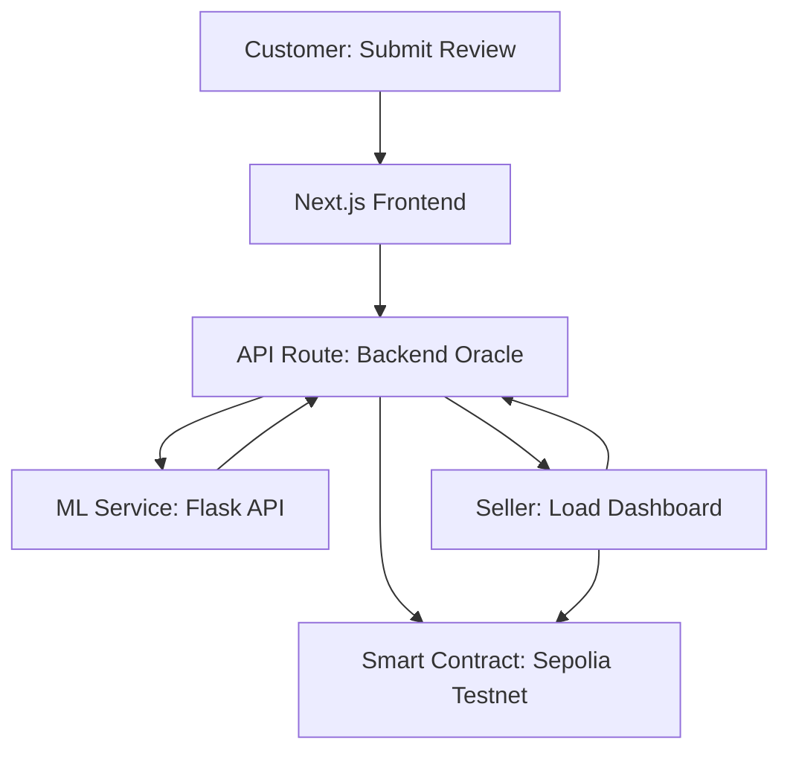

# TrustLens: A Decentralized Reputation Protocol


> A universal, user-owned "Trust Passport" for e-commerce, built by combining AI-powered verification with the immutability of the blockchain.

---

## 🚀 Live Demo & Screenshot

**[➡️ Explore the Live Seller Dashboard](https://your-live-demo-url.com)**


---

## 💡 The Problem: The Crisis of Digital Trust

Online trust is fragmented and insecure. A user’s reputation on one platform holds no value on another. This results in friction for good users and gives fraudsters the ability to exploit systems with new accounts. TrustLens offers a single, verifiable source of truth for online reputation by combining AI verification with blockchain attestations.

---

## ✨ Key Features

* **Universal Trust Passport:** A portable, on-chain reputation users own and control.
* **AI-Powered Verification:** Real-time review analysis to detect fraud, spam, or manipulation.
* **Immutable Credentials:** Validated actions are recorded on-chain as attestations.
* **Secure Oracle Backend:** Server-side signing ensures only trusted data is written on-chain.
* **Seller Analytics Dashboard:** Track user trust scores, view attestations, and review authenticity.
* **Stealth Moderation:** Malicious content is shadowbanned to protect platform integrity silently.

---

## 🧱 Technical Architecture

TrustLens is a modular, decoupled architecture blending Web2 performance with Web3 security.



1. **Frontend:** Built with Next.js and Tailwind CSS for both customers and sellers.
2. **Backend Oracle:** Secured API routes verify and route data, and write to smart contracts.
3. **AI Microservice:** Python Flask-based service scores review authenticity.
4. **Smart Contract:** Lightweight Solidity contract deployed on Sepolia for storing verifiable reputation data.

---

## 🛠️ Tech Stack

### Frontend

* Next.js (App Router)
* React
* Tailwind CSS
* ShadCN UI

### Backend

* Next.js API Routes
* Prisma ORM
* Supabase (PostgreSQL)
* Clerk (Authentication)

### Blockchain

* Solidity Smart Contract (Sepolia)
* Ethers.js
* Remix IDE
* Alchemy (RPC Provider)

### AI / ML

* Python + Flask Microservice

---

## ⚙️ Getting Started

### Prerequisites

* Node.js (v18+)
* pnpm / npm / yarn
* MetaMask extension
* VS Code or another editor

### 1. Clone & Install Dependencies

```bash
git clone https://github.com/your-username/TrustLens.git
cd TrustLens
pnpm install
```

### 2. Blockchain Setup (Remix IDE)

* Open [Remix IDE](https://remix.ethereum.org)
* Create `TrustLens.sol`, paste the contract code
* Use Compiler version 0.8.20
* Deploy using "Injected Provider - MetaMask" on Sepolia
* Copy the deployed **Contract Address** and **ABI**

### 3. Configure Environment Variables

Create a `.env` file:

```env
# Supabase
DATABASE_URL="your_supabase_connection_string"
DIRECT_URL="your_supabase_direct_connection_string"

# Clerk
NEXT_PUBLIC_CLERK_PUBLISHABLE_KEY="pk_test_..."
CLERK_SECRET_KEY="sk_test_..."

# Blockchain
SEPOLIA_RPC_URL="https://eth-sepolia.g.alchemy.com/v2/YOUR_ALCHEMY_API_KEY"
OWNER_PRIVATE_KEY="YOUR_METAMASK_PRIVATE_KEY"
NEXT_PUBLIC_CONTRACT_ADDRESS="YOUR_CONTRACT_ADDRESS"
NEXT_PUBLIC_APP_URL="http://localhost:3000"
```

### 4. Set Up Database

```bash
pnpm prisma migrate dev
# Optional: Visual data editor
pnpm prisma studio
```

### 5. Run the Application

```bash
pnpm dev
```

Visit `http://localhost:3000`

---

## 🤝 Contributing

Pull requests are welcome. For major changes, please open an issue first.

---

## 📄 License

MIT License — see [LICENSE](./LICENSE) for details.

---

## 📬 Contact

For questions, contact the team via [your-email@example.com](mailto:your-email@example.com) or open an issue in the repo.

---

> Built with ❤️ by the TrustLens Team
